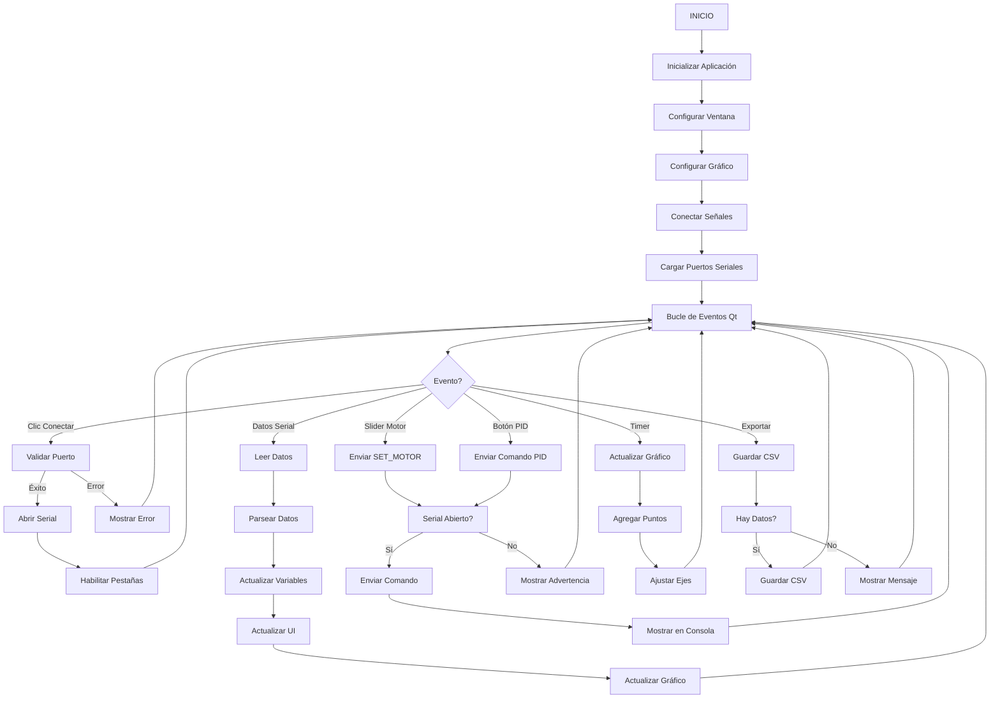

# Diagrama de Flujo Simplificado - GUI Germini

## Cómo Crear un Diagrama de Flujo que Represente el Comportamiento de la Interfaz Gráfica

Un diagrama de flujo para una aplicación GUI debe representar el flujo de eventos, la interacción del usuario, y cómo la aplicación responde a esas interacciones. Para la GUI Germini, sigue estos pasos:

---

## 1. Identificar los Componentes Principales

La GUI tiene los siguientes componentes principales:

- **Inicialización**: Configuración de la ventana y componentes
- **Conexión Serial**: Gestión de comunicación con el ESP32
- **Recepción de Datos**: Procesamiento de datos de sensores recibidos
- **Envío de Comandos**: Control de actuadores (motores, servo)
- **Visualización**: Gráficos en tiempo real y métricas
- **Control PID**: Configuración y activación del controlador PID
- **Exportación**: Guardado de datos en CSV

---

## 2. Estructura del Diagrama de Flujo

### **Nivel 1: Flujo Principal de la Aplicación**

```
┌─────────────┐
│   INICIO    │
└──────┬──────┘
       │
       ▼
┌─────────────────────┐
│   INICIALIZACIÓN     │
│ - Crear ventana      │
│ - Configurar gráfico │
│ - Conectar señales   │
│ - Cargar puertos     │
└──────┬───────────────┘
       │
       ▼
┌─────────────────────┐
│   BUCLE DE EVENTOS  │◄──────┐
│   (Qt Event Loop)   │       │
│                     │       │
│  Espera eventos:    │       │
│  - Clics de botones │       │
│  - Datos seriales   │       │
│  - Timer gráfico    │       │
│                     │       │
└──────────┬──────────┘       │
           │                   │
           └───────────────────┘
```

---

## 3. Detalle de Cada Sección

### **A. INICIALIZACIÓN (Constructor)**

```
┌─────────────────────┐
│   CONSTRUCTOR       │
└──────────┬──────────┘
           │
           ▼
┌─────────────────────┐
│ Crear QSerialPort   │
└──────────┬──────────┘
           │
           ▼
┌─────────────────────┐
│ Configurar Gráfico  │
│ - Crear series      │
│ - Configurar ejes   │
│ - Iniciar timer     │
└──────────┬──────────┘
           │
           ▼
┌─────────────────────┐
│ Conectar Señales    │
│ - Botones           │
│ - Sliders           │
│ - Serial readyRead  │
└──────────┬──────────┘
           │
           ▼
┌─────────────────────┐
│ Cargar Puertos      │
│ Serial Disponibles  │
└──────────┬──────────┘
           │
           ▼
┌─────────────────────┐
│   VENTANA LISTA     │
└─────────────────────┘
```

### **B. CONEXIÓN SERIAL**

```
┌─────────────────────┐
│ Usuario: Conectar   │
└──────────┬──────────┘
           │
           ▼
┌─────────────────────┐
│ ¿Puerto válido?     │
└──────┬──────────┬───┘
       │ NO       │ SÍ
       ▼          │
┌─────────────┐   │
│ Mostrar     │   │
│ Error       │   │
└─────────────┘   │
                  ▼
┌─────────────────────┐
│ Configurar Serial   │
│ - Puerto            │
│ - Baudrate          │
│ - Paridad           │
└──────────┬──────────┘
           │
           ▼
┌─────────────────────┐
│ Abrir Puerto Serial  │
└──────┬──────────┬───┘
       │ FALLO    │ ÉXITO
       ▼          │
┌─────────────┐   │
│ Mostrar     │   │
│ Error       │   │
└─────────────┘   │
                  ▼
┌─────────────────────┐
│ Habilitar Pestañas  │
│ Iniciar Timer       │
│ Actualizar UI       │
└─────────────────────┘
```

### **C. RECEPCIÓN DE DATOS SERIALES**

```
┌─────────────────────┐
│ Datos Disponibles   │
│ en Serial Port      │
└──────────┬──────────┘
           │
           ▼
┌─────────────────────┐
│ Leer Datos          │
│ Agregar a Buffer    │
└──────────┬──────────┘
           │
           ▼
┌─────────────────────┐
│ ¿Línea completa?    │
│ (termina en \n)     │
└──────┬──────────┬───┘
       │ NO       │ SÍ
       │          │
       │          ▼
       │   ┌─────────────────────┐
       │   │ Procesar Línea      │
       │   └──────────┬──────────┘
       │              │
       │              ▼
       │   ┌─────────────────────┐
       │   │ ¿Formato DATA?      │
       │   └──────┬──────────┬───┘
       │          │ NO       │ SÍ
       │          │          │
       │          │          ▼
       │          │   ┌─────────────────────┐
       │          │   │ Parsear Datos       │
       │          │   │ - Temp1, Temp2      │
       │          │   │ - Hum1, Hum2        │
       │          │   │ - Promedios         │
       │          │   │ - Luz               │
       │          │   └──────────┬──────────┘
       │          │              │
       │          │              ▼
       │          │   ┌─────────────────────┐
       │          │   │ Actualizar Variables│
       │          │   │ Actualizar UI       │
       │          │   │ Actualizar Gráfico   │
       │          │   └──────────┬───────────┘
       │          │              │
       │          │              ▼
       │          │   ┌─────────────────────┐
       │          │   │ ¿Formato MOTOR?     │
       │          │   └──────┬──────────┬───┘
       │          │          │ NO       │ SÍ
       │          │          │          │
       │          │          │          ▼
       │          │          │   ┌─────────────────────┐
       │          │          │   │ Actualizar PWM       │
       │          │          │   │ Sincronizar Sliders  │
       │          │          │   └─────────────────────┘
       │          │          │
       │          │          ▼
       │          │   ┌─────────────────────┐
       │          │   │ ¿Formato PID?       │
       │          │   └──────┬──────────┬───┘
       │          │          │ NO       │ SÍ
       │          │          │          │
       │          │          │          ▼
       │          │          │   ┌─────────────────────┐
       │          │          │   │ Actualizar Estado   │
       │          │          │   │ PID y Salida        │
       │          │          │   └─────────────────────┘
       │          │          │
       │          └──────────┘
       │              │
       └──────────────┘
           │
           ▼
┌─────────────────────┐
│ Mostrar en Consola   │
└─────────────────────┘
```

### **D. ENVÍO DE COMANDOS**

```
┌─────────────────────┐
│ Evento de Usuario   │
│ (Slider, Botón, etc)│
└──────────┬──────────┘
           │
           ▼
┌─────────────────────┐
│ ¿Qué tipo?          │
└──────┬──────────────┘
       │
       ├─► Slider Motor ──────► Construir SET_MOTORX:Y
       ├─► SpinBox Motor ─────► Construir SET_MOTORX:Y
       ├─► Botón Servo ────────► Construir SET_SERVO:Y
       ├─► Botón PID ──────────► Construir ENABLE/DISABLE_PID
       ├─► Setpoint PID ───────► Construir SET_SETPOINT:Y
       └─► KP/KI/KD ───────────► Construir SET_KP/KI/KD:Y
           │
           ▼
┌─────────────────────┐
│ ¿Serial abierto?    │
└──────┬──────────┬───┘
       │ NO       │ SÍ
       ▼          │
┌─────────────┐   │
│ Mostrar     │   │
│ Advertencia │   │
└─────────────┘   │
                  ▼
┌─────────────────────┐
│ Enviar Comando      │
│ Serial.write()      │
└──────────┬──────────┘
           │
           ▼
┌─────────────────────┐
│ Mostrar en Consola  │
│ [TX] comando        │
└─────────────────────┘
```

### **E. ACTUALIZACIÓN DEL GRÁFICO**

```
┌─────────────────────┐
│ Timer Dispara        │
│ (cada 100ms)         │
└──────────┬───────────┘
           │
           ▼
┌─────────────────────┐
│ Calcular Tiempo     │
│ Transcurrido        │
└──────────┬───────────┘
           │
           ▼
┌─────────────────────┐
│ ¿Valores Válidos?   │
└──────┬──────────┬───┘
       │ NO       │ SÍ
       │          │
       │          ▼
       │   ┌─────────────────────┐
       │   │ ¿Variable          │
       │   │ Seleccionada?      │
       │   │ (Checkbox)          │
       │   └──────┬──────────┬───┘
       │          │ NO       │ SÍ
       │          │          │
       │          │          ▼
       │          │   ┌─────────────────────┐
       │          │   │ Agregar Punto        │
       │          │   │ a Serie              │
       │          │   └──────────┬───────────┘
       │          │              │
       │          │              ▼
       │          │   ┌─────────────────────┐
       │          │   │ Guardar en graphData │
       │          │   │ (para CSV)          │
       │          │   └──────────┬───────────┘
       │          │              │
       │          └──────────────┘
       │              │
       └──────────────┘
           │
           ▼
┌─────────────────────┐
│ ¿Puntos > MAX?       │
└──────┬──────────┬───┘
       │ NO       │ SÍ
       │          │
       │          ▼
       │   ┌─────────────────────┐
       │   │ Eliminar Puntos    │
       │   │ Antiguos           │
       │   └──────────┬──────────┘
       │              │
       └──────────────┘
           │
           ▼
┌─────────────────────┐
│ Ajustar Rango Eje X  │
│ (últimos 60 seg)     │
└──────────┬───────────┘
           │
           ▼
┌─────────────────────┐
│ Ajustar Rango Eje Y  │
│ (dinámico)           │
└──────────┬───────────┘
           │
           ▼
┌─────────────────────┐
│ Actualizar Vista     │
│ Gráfico              │
└─────────────────────┘
```

### **F. CONTROL DE MOTORES**

```
┌─────────────────────┐
│ Usuario Mueve       │
│ Slider/SpinBox      │
└──────────┬──────────┘
           │
           ▼
┌─────────────────────┐
│ Sincronizar         │
│ Slider ↔ SpinBox    │
└──────────┬──────────┘
           │
           ▼
┌─────────────────────┐
│ Construir Comando   │
│ SET_MOTORX:Y        │
└──────────┬──────────┘
           │
           ▼
┌─────────────────────┐
│ Enviar por Serial   │
└──────────┬──────────┘
           │
           ▼
┌─────────────────────┐
│ Actualizar Label PWM │
└─────────────────────┘
```

### **G. CONTROL PID**

```
┌─────────────────────┐
│ Usuario Configura    │
│ Parámetros PID        │
└──────────┬───────────┘
           │
           ▼
┌─────────────────────┐
│ ¿Qué Parámetro?     │
└──────┬──────────────┘
       │
       ├─► Setpoint ────────► Enviar SET_SETPOINT:X
       ├─► Kp ──────────────► Enviar SET_KP:X
       ├─► Ki ──────────────► Enviar SET_KI:X
       ├─► Kd ──────────────► Enviar SET_KD:X
       ├─► Activar ─────────► Enviar ENABLE_PID
       └─► Desactivar ──────► Enviar DISABLE_PID
           │
           ▼
┌─────────────────────┐
│ Actualizar UI        │
│ - Estado PID         │
│ - Salida PID         │
└─────────────────────┘
```

### **H. EXPORTACIÓN CSV**

```
┌─────────────────────┐
│ Usuario: Exportar    │
│ CSV                  │
└──────────┬───────────┘
           │
           ▼
┌─────────────────────┐
│ ¿Hay datos?          │
└──────┬──────────┬───┘
       │ NO       │ SÍ
       ▼          │
┌─────────────┐   │
│ Mostrar     │   │
│ Mensaje     │   │
└─────────────┘   │
                  ▼
┌─────────────────────┐
│ ¿Variable           │
│ Seleccionada?       │
└──────┬──────────┬───┘
       │ NO       │ SÍ
       ▼          │
┌─────────────┐   │
│ Mostrar     │   │
│ Advertencia │   │
└─────────────┘   │
                  ▼
┌─────────────────────┐
│ Diálogo Guardar      │
│ Archivo              │
└──────┬──────────┬───┘
       │ Cancelar │ Guardar
       │          │
       │          ▼
       │   ┌─────────────────────┐
       │   │ Crear Archivo CSV   │
       │   └──────────┬──────────┘
       │              │
       │              ▼
       │   ┌─────────────────────┐
       │   │ Escribir Encabezado │
       │   │ (según checkboxes)  │
       │   └──────────┬──────────┘
       │              │
       │              ▼
       │   ┌─────────────────────┐
       │   │ Escribir Datos      │
       │   │ (solo seleccionados)│
       │   └──────────┬──────────┘
       │              │
       │              ▼
       │   ┌─────────────────────┐
       │   │ Cerrar Archivo      │
       │   │ Mostrar Confirmación│
       │   └─────────────────────┘
       │
       └──► (Fin)
```

---

## 4. Diagrama de Flujo Completo Simplificado

```
                    ┌─────────────┐
                    │   INICIO    │
                    └──────┬──────┘
                           │
                           ▼
                    ┌──────────────┐
                    │ INICIALIZAR   │
                    │ - Ventana     │
                    │ - Gráfico     │
                    │ - Serial      │
                    │ - Señales     │
                    └──────┬───────┘
                           │
                           ▼
         ┌─────────────────────────────────┐
         │    BUCLE DE EVENTOS (Qt)        │
         └─────────────────┬───────────────┘
                           │
         ┌─────────────────┴─────────────────┐
         │                                     │
         ▼                                     ▼
┌────────────────┐              ┌──────────────────┐
│ Evento Usuario │              │ Datos Serial      │
└────────┬───────┘              └────────┬─────────┘
         │                               │
         ▼                               ▼
┌────────────────┐              ┌──────────────────┐
│ Identificar    │              │ Leer Buffer      │
│ Tipo Evento    │              └────────┬─────────┘
└────────┬───────┘                       │
         │                               ▼
         ├─► Conectar ───► Abrir Serial  │
         ├─► Desconectar ─► Cerrar Serial│
         ├─► Slider Motor ─► Enviar SET_MOTOR│
         ├─► Botón Servo ─► Enviar SET_SERVO│
         ├─► PID Config ─► Enviar SET_KP/KI/KD│
         ├─► Activar PID ─► Enviar ENABLE_PID│
         └─► Exportar ───► Guardar CSV   │
             │                            │
             └────────────────────────────┘
                           │
                           ▼
              ┌──────────────────────┐
              │ Procesar Datos       │
              │ - Parsear formato    │
              │ - Actualizar variables│
              └──────────┬───────────┘
                         │
                         ▼
              ┌──────────────────────┐
              │ Actualizar UI        │
              │ - Métricas           │
              │ - Gráfico            │
              │ - Consola            │
              └──────────┬───────────┘
                         │
                         └──► (Repetir Bucle)
```

---

## 5. Flujo de Datos (Data Flow)

```
┌──────────────┐
│   ESP32      │
│  (Firmware)  │
└──────┬───────┘
       │ Serial
       │ (115200 baud)
       ▼
┌──────────────┐
│ QSerialPort  │
│ (Recepción)  │
└──────┬───────┘
       │
       ▼
┌──────────────┐
│ Buffer       │
│ Serial       │
└──────┬───────┘
       │
       ▼
┌──────────────┐
│ Parsear Datos   │
│ - DATA:...      │
│ - MOTOR:...     │
│ - PID:...       │
└──────┬──────────┘
       │
       ├─► Variables Globales
       │   (currentTemperature1, etc.)
       │
       ├─► Actualizar Labels UI
       │
       ├─► Agregar a graphData
       │
       └─► Mostrar en Consola
```

---

## 6. Flujo de Comandos (Command Flow)

```
┌──────────────┐
│   Usuario    │
│  (Interfaz)  │
└──────┬───────┘
       │
       ├─► Slider/SpinBox
       ├─► Botón
       └─► Checkbox
       │
       ▼
┌──────────────┐
│ Construir    │
│ Comando      │
│ (String)     │
└──────┬───────┘
       │
       ▼
┌──────────────┐
│ sendCommand()│
└──────┬───────┘
       │
       ▼
┌──────────────┐
│ QSerialPort  │
│ (Envío)      │
└──────┬───────┘
       │ Serial
       │ (115200 baud)
       ▼
┌──────────────┐
│   ESP32      │
│  (Firmware)  │
└──────────────┘
```

---

## 7. Estados de la Aplicación

```
┌─────────────────────┐
│   ESTADO INICIAL     │
│ - Serial cerrado     │
│ - Pestañas           │
│   deshabilitadas     │
│ - Gráfico detenido    │
└──────┬───────────────┘
       │
       │ Usuario: Conectar
       │
       ▼
┌─────────────────────┐
│   ESTADO CONECTADO   │
│ - Serial abierto     │
│ - Pestañas           │
│   habilitadas        │
│ - Gráfico activo      │
│ - Recibiendo datos   │
└──────┬───────────────┘
       │
       │ Usuario: Desconectar
       │
       ▼
┌─────────────────────┐
│   ESTADO DESCONECTADO│
│ - Serial cerrado     │
│ - Pestañas           │
│   deshabilitadas     │
│ - Gráfico detenido    │
└─────────────────────┘
```

---

## 8. Ejemplo en Mermaid (para Markdown)



---

## 9. Puntos Clave del Comportamiento

1. **Arquitectura basada en eventos**: La aplicación Qt usa un bucle de eventos que responde a señales y eventos
2. **Comunicación asíncrona**: Los datos seriales llegan de forma asíncrona y se procesan cuando están disponibles
3. **Actualización periódica**: El gráfico se actualiza cada 100ms mediante un QTimer
4. **Buffer de datos**: Los datos seriales pueden llegar fragmentados, por lo que se usa un buffer
5. **Sincronización bidireccional**: Los sliders y spinboxes se sincronizan entre sí
6. **Validación de datos**: Los datos recibidos se validan antes de actualizar la UI
7. **Estados de conexión**: La aplicación tiene estados claros (conectado/desconectado) que afectan la funcionalidad

---

## 10. Flujos Específicos por Funcionalidad

### **Flujo de Conexión/Desconexión**

```
Usuario → Botón Conectar → Validar Puerto → Abrir Serial → Habilitar Pestañas → Iniciar Timer
Usuario → Botón Desconectar → Cerrar Serial → Deshabilitar Pestañas → Detener Timer
```

### **Flujo de Control de Motor**

```
Usuario → Mover Slider → Sincronizar SpinBox → Construir Comando → Enviar Serial → Actualizar Label
```

### **Flujo de Visualización**

```
Serial → Recibir Datos → Parsear → Actualizar Variables → Agregar a Gráfico → Actualizar Vista
Timer → Calcular Tiempo → Agregar Puntos → Ajustar Ejes → Redibujar
```

### **Flujo de Exportación**

```
Usuario → Botón Exportar → Validar Datos → Diálogo Guardar → Escribir CSV → Confirmar
```

---

## Conclusión

Un diagrama de flujo simplificado para una GUI debe mostrar:

- **Inicialización**: Configuración inicial de componentes
- **Bucle de eventos**: Cómo la aplicación responde a eventos
- **Flujos de datos**: Cómo los datos fluyen desde el hardware hasta la visualización
- **Flujos de comandos**: Cómo las acciones del usuario se convierten en comandos
- **Estados**: Los diferentes estados de la aplicación y las transiciones entre ellos
- **Procesamiento**: Cómo se procesan y validan los datos recibidos

No es necesario incluir todos los detalles de implementación, solo los flujos principales y las decisiones críticas que afectan el comportamiento de la interfaz.
